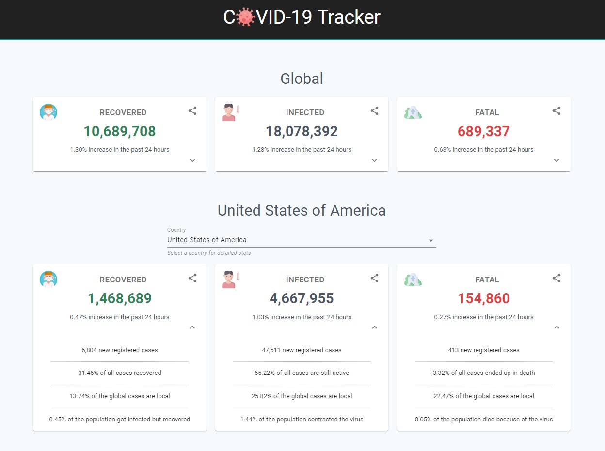
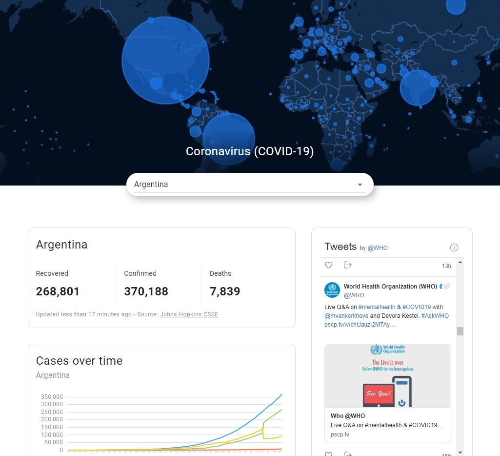

# Covid 19 - Tracker
Stay updated with the latest information related to the virus, with daily updates for global and local cases.

You can see a live demo of the application [here](https://nahuel-ianni.github.io/covid-19-tracker/).


## Table of contents
* [Features](#features)
* [Screenshots](#screenshots)
* [Getting started](#getting-started)
* [Built with](#built-with)
* [Author](#author)


## Features
- Global statistics and number of infected, recovered and fatal cases, updated daily
- Country-based statistics, including percentage of the local population affected by the virus
- Preventive measures recommended by the World Health Organization
- Social media - sharing options
- Responsive design


## Screenshots
Published version (tag: 'v1.0'):  



Working version (master branch):   




## Getting Started
These instructions will get you a copy of the project up and running on your local machine for development and testing purposes. See deployment for notes on how to deploy the project on a live system.

### Prerequisites
Make sure your machine has the following frameworks installed:

* [Node.js](https://nodejs.org/en/)


### Installing
In order to have a working copy for development purposes, you need to install the project dependencies, specified on the src folder

```
$ cd src
$ npm install
```

You should now be ready to work on the project.  
You can start the development server using Node

```
$ cd src
$ npm start
```

This will allow you to navigate to the website, by default on http://localhost:3000

More scripts, including deployment and test, can be found [here](./src/README.md).


## Deployment
A production version of the project can be created and deployed on the `build` folder, which bundles React in production mode and optimizes the build for the best performance.

```
$ cd src
$ npm run build
```

### Demo version deployment
The project has been configured to automatically deploy a new production version by running the following command:
```
$ npm run deploy
```

This will create a new build package and deploy it on the `demo` branch of the project on GitHub automatically.  
In order to change this, please refer to line 22 on the `package.json` file:
```
"deploy": "gh-pages -b demo -d build", 
```

More information can be found [here](https://create-react-app.dev/docs/deployment).


## Built with
The application was created using [React](https://reactjs.org/) and [React hooks](https://reactjs.org/docs/hooks-intro.html).

Covid-related data taken from [Covid19 api](https://covid19api.com/).  
List of countries and their population taken from [Rest countries](https://restcountries.eu/).  
Icons taken from [Flat Icon](https://www.flaticon.com/).


## Author
* **Nahuel Ianni** - [nahuel-ianni](https://github.com/nahuel-ianni)
